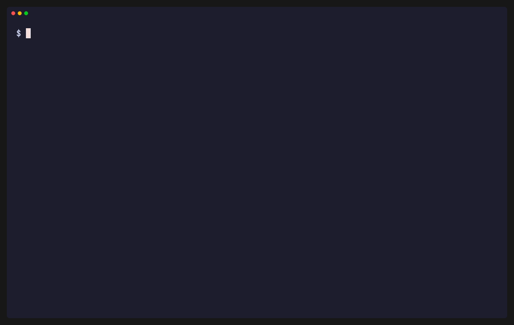

# Plaintext Projects (`pm`)



`pm` is a standalone command-line tool for managing projects and tasks stored as
readable `*.tasks.yaml` files. There is no hosted application and no database:
plain files are the source of truth and Git is the change history. `pm` is built
for both people (concise terminal output) and LLM agents (structured `--json`).

> **Status:** the task format and CLI contract are frozen at schema version 1 and
> live in [`docs/spec/`](docs/spec/); this repository implements the `pm`
> executable against them.

## What it does

- Discovers `*.tasks.yaml` files recursively, honoring `.gitignore` semantics
  without requiring the `git` executable.
- Validates files against schema version 1 with strict, actionable errors.
- Lists, filters, and inspects projects and tasks.
- Safely creates and edits projects and tasks, and drives their lifecycles,
  with atomic writes that leave the original file untouched on any failure.
- Emits a deterministic canonical format so `format` is idempotent.

## Usage

Full command reference and examples: [`docs/usage.md`](docs/usage.md).

```sh
export PM_ROOT=/path/to/tasks          # optional default discovery root
pm projects list                       # overview with progress bars
pm tasks list --project website        # open tasks for one project
pm tasks add --project website --title "Design the header" --priority 1
pm tasks status web-001 in-progress
pm --json tasks list --status todo     # machine-readable output for agents
```

## Specifications (normative, frozen)

The behavior contract is versioned in this repository under
[`docs/spec/`](docs/spec/):

- [**Project task format**](docs/spec/project-task-format.md) — schema version 1:
  the restricted YAML profile, canonical field order, IDs, and validation rules.
- [**CLI specification**](docs/spec/cli-specification.md) — commands, output,
  mutation safety, and exit codes.

They are frozen: `pm` implements them, and a change to either is a deliberate
spec amendment that lands in the same change as the code.

Our build plan lives in this repo: [`implementation-plan.md`](implementation-plan.md).

The demo above is recorded from [`docs/demo.tape`](docs/demo.tape) with
[vhs](https://github.com/charmbracelet/vhs) against a throwaway workspace; run
`make demo` to re-record it after a change to the output.

## Install

`pm` is a single self-contained binary with no runtime dependencies.

**Prebuilt binary** — download the archive for your OS/arch from the
[releases page](https://github.com/TheDivic/plaintext-projects/releases), extract
it, and put `pm` on your `PATH`.

**With Go** (1.26+):

```sh
go install github.com/TheDivic/plaintext-projects/cmd/pm@latest
```

**From source:**

```sh
git clone https://github.com/TheDivic/plaintext-projects
cd plaintext-projects
make build            # produces ./bin/pm with version metadata baked in
```

Verify the install and set a default discovery root so you can omit `--root`:

```sh
pm version
export PM_ROOT=/path/to/your/tasks   # optional; --root overrides it
```

Enable shell completion for task IDs, project IDs, statuses, and tags:

```sh
pm completion zsh > "${fpath[1]}/_pm"    # or bash / fish / powershell
```

## Agent use

Pass `--json` to any command for structured output and rely on the exit codes;
`pm` never prompts. To teach an LLM agent to drive `pm` without reading this
repository, hand it the portable skill in [`skills/`](skills/README.md) — it
carries the full command surface, the lifecycle rules, and the file schema.

## Requirements

- **Linux or macOS** (amd64 or arm64). `pm` guards concurrent writes with a
  `flock` advisory lock, which Windows does not provide; Windows support needs a
  separate implementation and is not in this release.
- To build from source: Go 1.26 or newer. Prebuilt binaries need no runtime.

## Development

```sh
make check   # gofmt check, go vet, golangci-lint, go test -race  (the CI gate)
make build   # builds ./bin/pm
make fmt     # rewrite files to canonical formatting
```

Enable the local push guard once after cloning:

```sh
git config core.hooksPath .githooks
```

See [`CONTRIBUTING.md`](CONTRIBUTING.md) for the full workflow, commit
conventions, and quality gates.

## License

[MIT](LICENSE) © Nikola Divić
